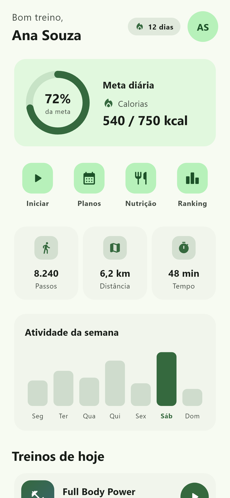
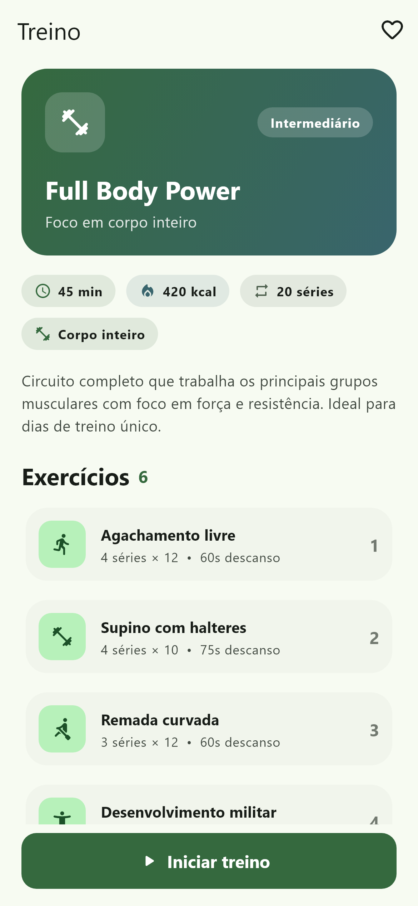
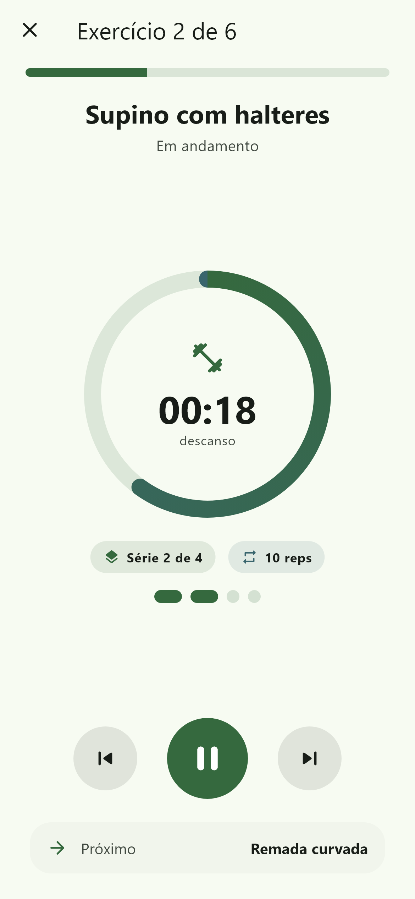
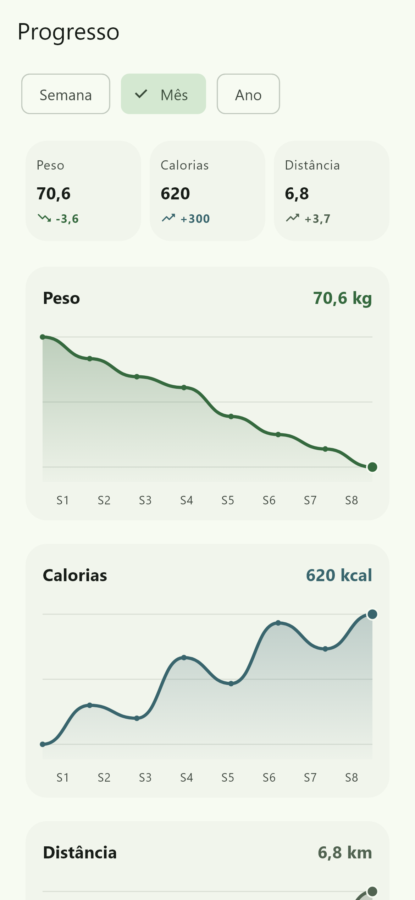
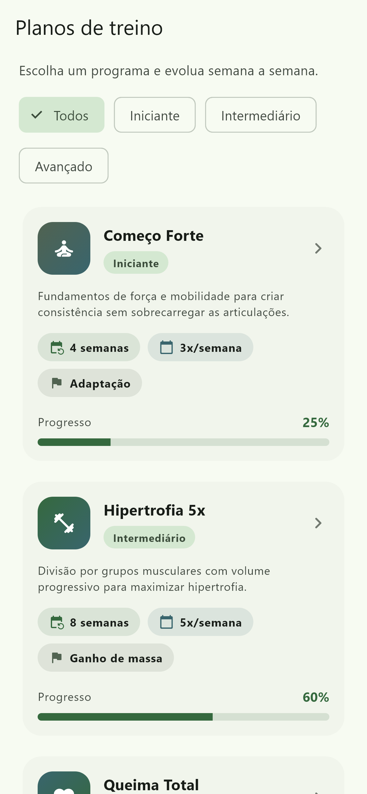
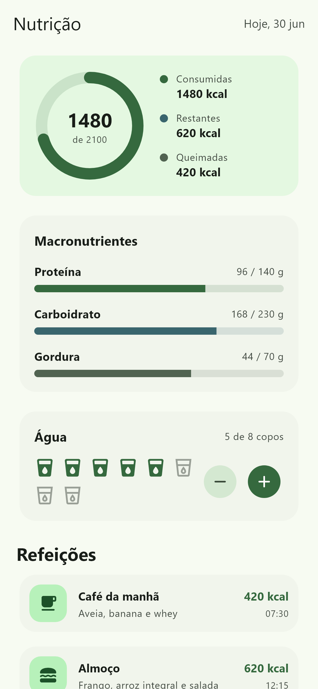

# Flutter Fitness

> Treino e atividade em Flutter

[](./LICENSE) 

App de treino/atividade em Flutter 3.44 + Material 3, com 8 telas e tema claro/escuro: início com anel de meta e stats; detalhe do treino com exercícios; player de exercício com timer circular; progresso com gráficos de linha e conquistas; planos por nível; nutrição com macros e água; perfil; e ranking com pódio. Gráficos e anéis em CustomPaint, arquitetura em camadas com MVVM, go_router.

## 🧱 Stack

- Flutter 3.44
- Dart 3
- Material 3
- go_router
- provider
- http

## ✨ Recursos

- Flutter 3.44 (último stable) via FVM
- Material 3 com tema claro e escuro
- Arquitetura em camadas (data/domain/ui) + MVVM
- Navegação declarativa com go_router
- Modelos com JSON (fromJson/toJson) + serviço http
- Anel de meta, estatísticas e treinos do dia
- Layout responsivo (mobile, tablet, desktop)
- Android · iOS · Web · Windows + testes de widget

## 🖥️ Telas








## 🚀 Como rodar

Requer o [Flutter SDK](https://docs.flutter.dev/get-started/install) instalado (canal stable).

```bash
flutter pub get
flutter run
```

Para rodar na web: `flutter run -d chrome`. Para gerar o APK: `flutter build apk`.

## ❤️ Apoie o projeto

Curtiu e quer ajudar a manter os templates gratuitos? Faça uma doação (escolha o valor e a forma de pagamento):

**➡️ https://template.dev.br/doar?template=flutter-fitness**

## 🔗 Mais templates

Veja o catálogo completo (grátis e premium) em **https://template.dev.br**

## 📄 Licença

[MIT](./LICENSE) © 2026 Danilo Quinelato
